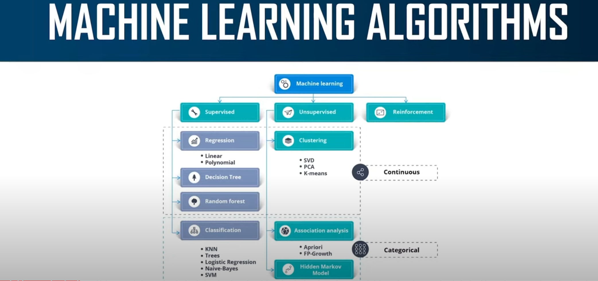

# AI & ML Notes

## Learning types
- Unsupervised learning
- Supervised learning
- Reinforcement learning
## ML Algorithms

  

## Supervised Learning
- Regression Based
    - Linear
    - Logistic
- Classification Based
    - Decision Tree: Decisions are based on some conditions.
    - Random Forests: Builds multiple decision trees and merges them together.
        - More accurate and stable prediction
        - Trained with bagging method
    - Naive Bayes: Based on Bayes theorem which relies on conditional probability.
        - Assumes that the presence of a particular feature in a class unrelated to the presence of another feature.
    - K-Nearest Neighbor: Classification is based on similarity measure
## Refernces
- [Penn State - Introduction to Probability Theory](https://online.stat.psu.edu/stat414/)
- [Machine Learning Full Course - 12 Hours | Machine Learning Roadmap [2024] | Edureka](https://www.youtube.com/watch?v=N5fSpaaxoZc)